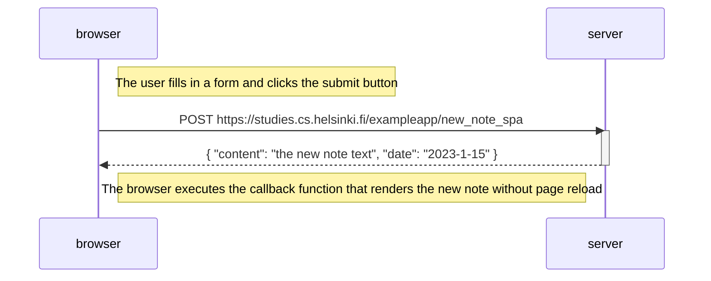

```mermaid
sequenceDiagram
participant browser
participant server

Note right of browser: The user fills in a form and clicks the submit button

browser->>server: POST https://studies.cs.helsinki.fi/exampleapp/new_note_spa
activate server
server-->>browser: { "content": "the new note text", "date": "2023-1-15" }
deactivate server

Note right of browser: The browser executes the callback function that renders the new note without page reload
```
